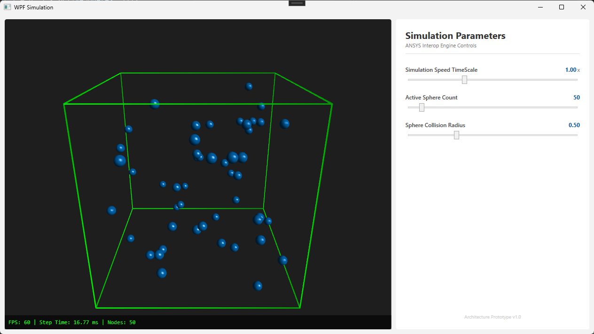

# wpf_simulation
# WPF Simulation

A high-performance WPF 3D application integrated with a native C++ physics engine simulation. Spheres bounce dynamically inside a 3D bounding box layout using raw pointer memory maps.

## Controls

Use the interactive control panel on the right side to adjust simulation metrics in real-time:
* **Simulation Speed TimeScale:** Speed up or slow down the physics progression loop ($0.5x$ to $2.0x$).
* **Active Sphere Count:** Adjust the number of sphere instances ($10$ to $500$). Modifying this dynamically scales the underlying C++ vector memory allocation.
* **Sphere Collision Radius:** Alter the bounding boundaries and collision sizes of all spheres.

## Features

* **Zero-Copy Interop Pipeline:** Eliminates C# marshalling overhead. The WPF frontend obtains a direct, raw pointer (`SphereData*`) targeting the native C++ memory heap for state synchronization.
* **Modern C++ RAII Architecture:** Native C++ library leverages `std::vector` for contiguous memory security and auto-cleanup tracking.
* **WPF Viewport3D Engine:** Utilizes Model3DGroup to render meshes of simulated spheres in parallel with native C++ simulation.

## Bulding and Running

### Prerequisites

* **Operating System:** Windows 10 or 11 (WPF is native to Windows).
* **IDE:** Visual Studio 2022 (Community, Professional, or Enterprise).
* **Workloads Required (via VS Installer):**
  * `.NET Desktop Development` (Includes .NET SDK)
  * `Desktop development with C++` (Includes MSVC compiler tools)

### Build Instructions

> [!IMPORTANT]
> Because this project maps raw physical memory pointers between runtime boundaries, you **must** build both projects under the exact same architecture. Mix-matching target bitness will result in a `BadImageFormatException`.

1. Open the solution file `WPF_Simulation.sln` inside Visual Studio.
2. In the top toolbar, change the build configuration dropdown to **`Any CPU`**, **`x86`**, or **`x64`**.
3. Select either **`Debug`** or **`Release`** (Release is highly recommended to observe maximum physics iteration limits).
4. Right-click the solution in the Solution Explorer and select **Build Solution** (or press `Ctrl + Shift + B`). This compiles the native C++ project first, creating the DLL, and links it directly to the WPF binary runtime build folder.
5. Press **`F5`** (or click the Start button) to launch the simulation.

## Time Spent

Roughly 6-8 hours split across multiple days.

## AI Usage

* Google Gemini Flash 3.5 was used for the template of both C++ and C# projects.
* It was used to help generate the XAML for the main window to ensure the C# code hooked into it functioned properly. I am not familiar with WPF and this project was intended as a learning experience.
* It was used to generate parts of this README.